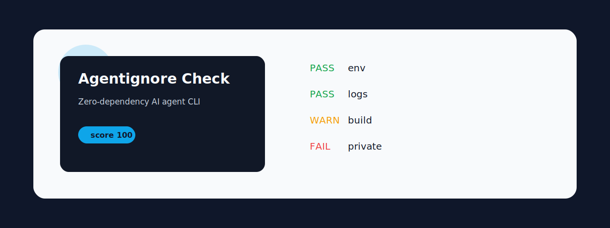
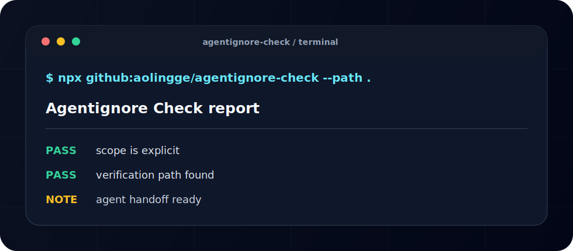

<p align="center">
  
</p>

<h1 align="center">Agentignore Check</h1>

<p align="center">Check whether a repo has an .agentignore-style file to keep AI agents away from secrets and noisy files.</p>

<p align="center"><a href="README.zh-CN.md">中文</a> · <a href="#quick-start">Quick Start</a> · <a href="#checks">Checks</a></p>

<p align="center">
  
  
  
</p>

<p align="center">
  
</p>

## Why This Exists

AI agent tooling is growing quickly, but many repos still miss tiny checks that can run locally or in CI. This project stays zero-dependency, short-command, and easy to fork.

## Quick Start

```bash
npx github:aolingge/agentignore-check --path .agentignore
```

Generate Markdown:

```bash
npx github:aolingge/agentignore-check --path .agentignore --markdown > report.md
```

Use a score gate:

```bash
npx github:aolingge/agentignore-check --path .agentignore --min-score 80
```

## Checks

| Check | What it looks for |
| --- | --- |
| env | Ignores env and secret files. |
| logs | Ignores logs. |
| build | Ignores generated dependencies and builds. |
| private | Ignores private data. |

## Output

```text
Agentignore Check score: 100/100
PASS  example-check  Useful signal found
FAIL  missing-check  Add the missing guidance
```

## CI Usage

Use GitHub Actions annotations:

```bash
npx github:aolingge/agentignore-check --path fixtures/good.txt --annotations
```

Generate SARIF:

```bash
npx github:aolingge/agentignore-check --path fixtures/good.txt --sarif > results.sarif
```

See [docs/github-actions.md](docs/github-actions.md).

## Visual Identity

The banner and CLI preview are SVG assets committed in `assets/`, so the README renders cleanly on GitHub and Gitee without external image hosting.

## Mirrors

- GitHub: https://github.com/aolingge/agentignore-check
- Gitee: https://gitee.com/aolingge/agentignore-check

## Contributing

Good first PRs: add checks, add fixtures, improve docs, or add GitHub Actions examples.

## License

MIT
